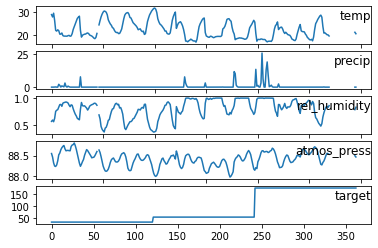

# AirQo Ugandan Air Quality Forecast Challenge

## Approach

Our solution treats the problem as a pseudo time-series where the algorithm learns the temporal nature of the data without any timestamp from which to extract time features. For this purpose, we utilize the idx features derived from the indices (positions) of the data points in their respective 5-day series using a stacked model to better learn the relationship between the meteorological variables and target.

### idx Features
Many relations involving serial data, such as the sum of the first n-terms of a series, are usually a function of n. Without any date-time index, we treat the weather recordings as ordinary series. Since the objective of this challenge is to learn the relationship between air quality and the meteorological variables—a mere function of a (time) series—we include the indices of the observations within each series (ID) as features for the base model. 

The idx features help model the linear patterns of the data and since these patterns exhibit a periodic trend, we extract more indices from series at various intervals. Each of the idx features are then encoded to acquire a better representation of the harmonic series. Together, the idx features and their encodings help the base model capture the trend and seasonality of the data.

### Lag Features
Looking at the plots for each of the original meteorological variables and the target, it can be observed that other than precipitation, most of the variables illustrate a trend in the five days leading up to the point when the air quality reading is taken. 



These variables are therefore shifted to allow for the base model to capture this trend from past and future values of each variable. 


It should be noted that all features based on time, such as the indices from various periods and the lag features, are extracted using the number of observations and not any date-time index.

### Further Feature Engineering
The wind variable is converted from its polar representation (wind_spd and wind_dir) to cartesian components (u and v) to allow for a more accurate representation of the data. The temperature variable, temp, is also used to create the eqn feature representing the [clausius-clapeyron relation](https://www.theweatherprediction.com/habyhints2/646/)—relating saturated vapor-pressure to temperature.

The data used in the meta learner also includes aggregates, such as the mean and standard deviation, of each of the weather variables for each series(ID). This is done so as to enable the meta learner to capture information from the data and acquire a better representation. 

### Model Training and Prediction 
The algorithm is a stacked ensemble using a Light Gradient Boost Model (LGBM) as the base model and a CatBoost model as the meta-learner. Each of the 121 observations per ID are treated as separate series where the base model learns 121 different interactions of the variables for the same target value.

The base model is first trained using a 3-fold cross validation to generate out-of-fold predictions and identify optimal number of boosting rounds. It is then trained on the full train set and it is this model that is used to make predictions on the test set. Both out-of-fold and test predictions are made on each of the 121 series and averaged to give the mean value of the target.

The data used in the meta-learner places each variable’s value in the same row acting as one complete series with each lag value included. The averaged out-of-fold and test set predictions from the base model are also added into the train and test set, respectively, so that the meta learner can learn a better representation of the relationship between the target and predictors.

The meta-learner is trained using a 50-fold cross validation to determine the optimal number of iterations and the model is then trained on the full set and used to make predictions on the test set.

## `mlod` Package 

For ease of use and logical flow, we have compiled our code into an `mlod` package and included the `FinalNotebook.ipynb` file along with instructions below on how to run the code.

### Getting started

First, be sure that the folder structure is set as

```
--airqo-ugandan-air-quality-forecast-challenge/
    - mlod
    - requirements.txt
    - plot.png
    - README.md (this file)
    - FinalNotebook.ipynb
```

### If running on your local machine,

... and if the file structure is set in the stated manner, the rest of the instructions together with scripts used to initiate the project are included within the first couple of cells of the `FinalNotebook.ipynb` file. 

Simply run the `jupyter notebook` within this directory space from the terminal / anaconda prompt and you can get started. Be sure to have installed `anaconda` before hand

### If running on Colab,

Either upload the FinalNotebook.ipynb into Colab then connect to a runtime or Click on the "Open on Colab" badge. Then run the top most cell, which contains the scripts that sets up the needed by the notebook (except the data files, `Train.csv` and `Test.csv`)

-------------

After placing the files in the specified locations, run the cells under **"Run these cells only once during a session"** section.

At this point, you have already set up the requirements needed to move along with the model preprocessing and training.

### You are set!

Now that you have set up the needed code and packages, you'll have to save the original `Train.csv` and `Test.csv` inside a newly created `data` folder, otherwise, the code wont be able to process the files.

There after, you can begin running the other cells within the notebook one at a time, feel free to read the code within our package while you are at it. They include documentation for the most part

------------

**Information that follow from here are to provide further understanding on the parts of `mlod`**

------------

## Understanding `mlod`

The following information tries to explain the different parts of the `mlod` package

The package is built with certain things in mind:
1. Building a **pipeline (work flow)** that can be **easily understood**.
3. **Modular code** that can allow use to change things **easily**, with **minimal risk**
3. Having a way to **track our code** and achieve **reproducible** results

That said, the main components that were created for the sake of this competition are the `PreProcessors`, configuration code (`Config`) and `Models`

### `PreProcessor`

These are classes that are built to preprocess the data. This should convert the data from the original form, to the form that is needed just before feeding it to the model(s).

For our ensemble model, we preprocessed our original data in 2 different ways, for the 2 different models as reflected in the:

 - `MlodPreProcessor` - originally devised by us.
 - `AirQoPreProcessor` - an alternative version modified from an approach in the Zindi Discussions. See [Zindi Discussion #1116](https://zindi.africa/competitions/airqo-ugandan-air-quality-forecast-challenge/discussions/1116).

### `Config` and other constants

This contains the different configurations that used throughout our code. This includes things like the model parameters, seed number, and features to perform selective feature engineering, among others.

### `Model`

These are the classes that contain the implementation of ML(tree-booster) models
that we used in achieving our score. These models are wrapped in the classes:
- `LGBModel` - which contains the implementation of the [lightGBM](https://lightgbm.readthedocs.io/en/latest/) that is used as our base model
- `CatBoostModel` - which contains the implementation of the [CatBoost](https://catboost.ai/) model that is stacked on top of the base model

These classes are strategically called in the notebook file.
Details about these classes are explained in our `mlod` package.

##### Now that you know what's up, run the notebook

## Issues with our code:

Feel free to add any issue regarding the notebook or code to this github repo 

Happy Coding! :)
